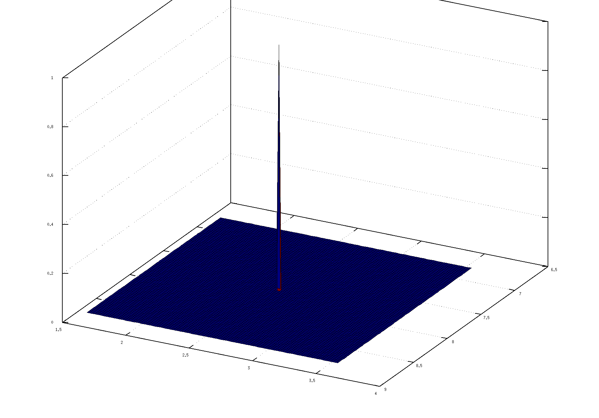

# Playground

This is an experiment around lines with angular representations, see `angular_line`. 

## Sampling

It uses `angularrnd` to generate points on a line segment. It uses the so-called **normal form** of a line (angle, distance to origin) to do so. 

    % LP, the closest point on the line w.r.t. the origin 
    LP = [p*cos(θ) p*sin(θ)];

It will transform a line segment from [d1-d2] on the x-axis according to these line coordinates. And it will add noise perpendicular to the line.

## Probability density function

It uses `logangularpdf` to calculate the log-likelihood for an individual combination of angle and distance for N observations.

If we rotate over the x-y place we rotate in the z-direction.

    R2z = [ cos(θ_z) sin(θ_z); -sin(θ_z) cos(θ_z) ]

Suppose we have a point as a column vector:

    p = [x; y]

We can calculate the distance between p and the line [θ, 0] as:

    q = R2z * p
    L = |q(2)|

The distance between p and the line [θ, d] becomes then: d-L if the line is further from the projection than q,
L-d if the line is closer to the projection than q, or d+L if the line is projecting from the other side.

If we rotate in 3D we have:

    R3z, R3y, and R3x, the Euler rotation matrices.
    p = [x; y; z]
    L = || q(2) + q(3) ||_2

These different rotations can be played with using `test_lines.m`.

## Visualization

To visualize the pdf, every combination of angle and distance is calculated with a picked resolution around these known values. This is only to show that the probability density function is correct:

## Notes

One thing that has be kept in mind is that the current visualization visualizes the likelihood, not the log-likelihood. Due to the extra exponential it can happen that the calculations return `Inf` for the likelihood calculations. It is recommended to use only log-likelihood in MCMC sampling.
